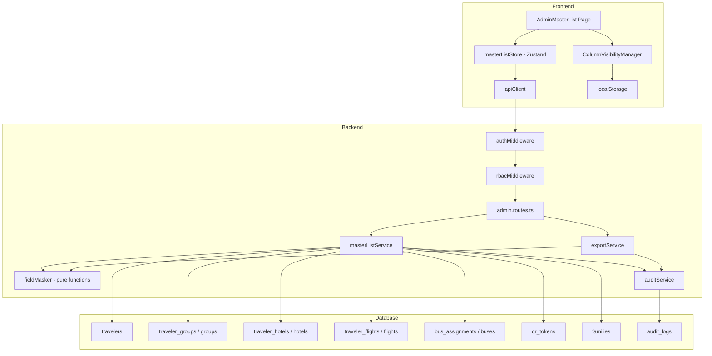

# Design Document: Admin Master List

## Overview

The Admin Master List extends the existing admin panel with a comprehensive, privacy-compliant view of all traveler data. It replaces the limited 5-column `AdminTravelers` page with a full "Master List" that JOINs across `travelers`, `groups`, `hotels`, `flights`, `buses`, `qr_tokens`, and `families`. The system adds server-side search/filter/sort with pagination, PII field masking (pure functions), audit logging for all data access, CSV export with streaming, column visibility toggles persisted in localStorage, and role-based field visibility.

The backend follows the existing factory-pattern service architecture (`createMasterListService`) with Express routes added to `admin.routes.ts`. The frontend adds a new `AdminMasterList` page using Zustand for state management, consistent with the existing admin pages. PII masking is implemented as pure functions in a shared utility, making them independently testable with property-based tests via fast-check.

## Architecture



### Key Design Decisions

1. **Single SQL query with LEFT JOINs and aggregation** — Rather than N+1 queries, the master list query uses a single CTE-based query that LEFT JOINs all related tables and aggregates arrays using `array_agg` / `json_agg`. This keeps the API response time predictable regardless of the number of related entities.

2. **Pure function masking** — The `fieldMasker` module exports pure functions (`maskEmail`, `maskPhone`, `maskPassportName`) that accept a string and return a masked string. This makes them trivially testable with property-based tests and reusable across the API response and CSV export paths.

3. **Role-based field projection** — Instead of masking restricted fields, the API omits them entirely for `admin` role users. A `projectFieldsByRole` function filters the response object before serialization, ensuring `email_aliases` and `guardian_id` never leave the server for non-super_admin users.

4. **Streaming CSV export** — The export endpoint uses Node.js `Transform` streams to convert database cursor rows into CSV lines, avoiding loading the full result set into memory. The `pg` cursor library reads rows in batches of 100.

5. **Audit-before-response** — Audit log entries are written inside the request handler before `res.json()` / `res.pipe()` is called, ensuring the audit trail is complete even if the client disconnects mid-transfer.

## Components and Interfaces

### Backend Components

#### 1. `masterListService` (`packages/backend/src/services/master-list.service.ts`)

Factory function following the existing `createAdminService` pattern.

```typescript
interface MasterListServiceDeps {
  db: Pool;
  auditService: AuditService;
}

interface MasterListQueryParams {
  page?: number;
  page_size?: number;
  q?: string;
  role_type?: RoleType;
  access_status?: AccessStatus;
  group_id?: string;
  hotel_id?: string;
  sort_by?: string;
  sort_order?: 'asc' | 'desc';
  unmask?: boolean;
}

interface MasterListRow {
  traveler_id: string;
  booking_id: string | null;
  family_id: string | null;
  representative_id: string | null;
  guardian_id: string | null;
  full_name_raw: string;
  full_name_normalized: string;
  email_primary: string;
  email_aliases: string[] | null;
  passport_name: string | null;
  phone: string | null;
  role_type: RoleType;
  access_status: AccessStatus;
  created_at: string;
  updated_at: string;
  groups: string[];
  hotels: string[];
  flights: { flight_number: string; arrival_time: string }[];
  bus_assignments: { bus_number: string; event_name: string }[];
  qr_active: boolean;
}

interface PaginationEnvelope<T> {
  data: T[];
  total: number;
  page: number;
  page_size: number;
  total_pages: number;
}

function createMasterListService(deps: MasterListServiceDeps) {
  async function query(
    params: MasterListQueryParams,
    actor: { id: string; role: RoleType }
  ): Promise<PaginationEnvelope<MasterListRow>>;

  async function exportCsv(
    params: MasterListQueryParams,
    actor: { id: string; role: RoleType }
  ): AsyncGenerator<string>;
}
```

#### 2. `fieldMasker` (`packages/backend/src/utils/field-masker.ts`)

Pure functions for PII masking. No dependencies.

```typescript
function maskEmail(email: string): string;
function maskPhone(phone: string): string;
function maskPassportName(name: string): string;
function maskFieldValue(value: string, fieldType: 'email' | 'phone' | 'passport_name'): string;
function applyMasking(row: MasterListRow, shouldUnmask: boolean): MasterListRow;
```

#### 3. `projectFieldsByRole` (`packages/backend/src/utils/field-projection.ts`)

Pure function that removes fields based on role.

```typescript
function projectFieldsByRole(row: MasterListRow, role: RoleType): Partial<MasterListRow>;
```

#### 4. `validateSortColumn` (`packages/backend/src/utils/query-validators.ts`)

Pure function that validates sort column names against an allowlist.

```typescript
const ALLOWED_SORT_COLUMNS: readonly string[];
function validateSortColumn(column: string): boolean;
function sanitizeSortOrder(order: string | undefined): 'asc' | 'desc';
```

### Frontend Components

#### 5. `masterListStore` (`packages/frontend/src/stores/master-list.store.ts`)

Zustand store managing master list state.

```typescript
interface MasterListState {
  data: MasterListRow[];
  total: number;
  page: number;
  pageSize: number;
  totalPages: number;
  search: string;
  filters: { role_type?: string; access_status?: string; group_id?: string; hotel_id?: string };
  sortBy: string;
  sortOrder: 'asc' | 'desc';
  loading: boolean;
  error: string | null;
  visibleColumns: string[];
  fetchData: () => Promise<void>;
  setPage: (page: number) => void;
  setPageSize: (size: number) => void;
  setSearch: (q: string) => void;
  setFilter: (key: string, value: string) => void;
  setSort: (column: string) => void;
  setVisibleColumns: (columns: string[]) => void;
}
```

#### 6. `AdminMasterList` page (`packages/frontend/src/pages/AdminMasterList.tsx`)

React page component rendering the master list table with search, filters, sort, pagination, column visibility toggles, and CSV export button.

#### 7. `ColumnVisibilityPanel` component (`packages/frontend/src/components/ColumnVisibilityPanel.tsx`)

Toggle panel for showing/hiding columns. Reads/writes localStorage keyed by `traveler_id`.

### Route Registration

Two new routes added to `admin.routes.ts`:
- `GET /api/v1/admin/master-list` → paginated, filtered, masked master list
- `GET /api/v1/admin/master-list/export` → streaming CSV download

Both routes are protected by the existing `authMiddleware` and `rbacMiddleware` (admin/super_admin only).

## Data Models

### Master List SQL Query (CTE-based)

```sql
WITH traveler_groups_agg AS (
  SELECT tg.traveler_id, array_agg(g.name ORDER BY g.name) AS groups
  FROM traveler_groups tg JOIN groups g ON tg.group_id = g.group_id
  GROUP BY tg.traveler_id
),
traveler_hotels_agg AS (
  SELECT th.traveler_id, array_agg(h.name ORDER BY h.name) AS hotels
  FROM traveler_hotels th JOIN hotels h ON th.hotel_id = h.hotel_id
  GROUP BY th.traveler_id
),
traveler_flights_agg AS (
  SELECT tf.traveler_id,
         json_agg(json_build_object('flight_number', f.flight_number, 'arrival_time', f.arrival_time) ORDER BY f.arrival_time) AS flights
  FROM traveler_flights tf JOIN flights f ON tf.flight_id = f.flight_id
  GROUP BY tf.traveler_id
),
traveler_buses_agg AS (
  SELECT ba.traveler_id,
         json_agg(json_build_object('bus_number', b.bus_number, 'event_name', e.name) ORDER BY e.date) AS bus_assignments
  FROM bus_assignments ba
  JOIN buses b ON ba.bus_id = b.bus_id
  JOIN events e ON ba.event_id = e.event_id
  GROUP BY ba.traveler_id
),
traveler_qr AS (
  SELECT traveler_id, bool_or(is_active) AS qr_active
  FROM qr_tokens
  GROUP BY traveler_id
)
SELECT
  t.traveler_id, t.booking_id, t.family_id, t.representative_id, t.guardian_id,
  t.full_name_raw, t.full_name_normalized, t.email_primary, t.email_aliases,
  t.passport_name, t.phone, t.role_type, t.access_status, t.created_at, t.updated_at,
  COALESCE(tga.groups, '{}') AS groups,
  COALESCE(tha.hotels, '{}') AS hotels,
  COALESCE(tfa.flights, '[]'::json) AS flights,
  COALESCE(tba.bus_assignments, '[]'::json) AS bus_assignments,
  COALESCE(tqr.qr_active, false) AS qr_active
FROM travelers t
LEFT JOIN traveler_groups_agg tga ON t.traveler_id = tga.traveler_id
LEFT JOIN traveler_hotels_agg tha ON t.traveler_id = tha.traveler_id
LEFT JOIN traveler_flights_agg tfa ON t.traveler_id = tfa.traveler_id
LEFT JOIN traveler_buses_agg tba ON t.traveler_id = tba.traveler_id
LEFT JOIN traveler_qr tqr ON t.traveler_id = tqr.traveler_id
-- WHERE / ORDER BY / LIMIT OFFSET appended dynamically
```

### Pagination Envelope (API Response)

```typescript
interface PaginationEnvelope<T> {
  data: T[];
  total: number;
  page: number;
  page_size: number;
  total_pages: number;
}
```

### Audit Log Entry Shape (for master list events)

```typescript
// action_type: 'master_list.view' | 'master_list.view_unmasked' | 'master_list.export'
// entity_type: 'traveler_list'
// entity_id: null (list-level, not entity-level)
// details: { filters, search, page, sort, record_count? }
```

### Column Visibility localStorage Schema

```typescript
// Key: `master-list-columns-${traveler_id}`
// Value: JSON string of string[] (visible column keys)
// Default columns: ['full_name_raw', 'email_primary', 'booking_id', 'role_type', 'access_status', 'groups', 'hotels', 'qr_active']
```

### Shared Types (added to `@wsb/shared/api-types.ts`)

```typescript
interface MasterListRow {
  traveler_id: string;
  booking_id: string | null;
  family_id: string | null;
  representative_id: string | null;
  guardian_id?: string | null;       // omitted for admin role
  full_name_raw: string;
  full_name_normalized: string;
  email_primary: string;
  email_aliases?: string[] | null;   // omitted for admin role
  passport_name: string | null;
  phone: string | null;
  role_type: RoleType;
  access_status: AccessStatus;
  created_at: string;
  updated_at: string;
  groups: string[];
  hotels: string[];
  flights: { flight_number: string; arrival_time: string }[];
  bus_assignments: { bus_number: string; event_name: string }[];
  qr_active: boolean;
}

interface MasterListResponse {
  data: MasterListRow[];
  total: number;
  page: number;
  page_size: number;
  total_pages: number;
}
```


## Correctness Properties

*A property is a characteristic or behavior that should hold true across all valid executions of a system — essentially, a formal statement about what the system should do. Properties serve as the bridge between human-readable specifications and machine-verifiable correctness guarantees.*

### Property 1: Pagination envelope correctness

*For any* non-negative total count and any page/page_size values (where page >= 1 and page_size >= 1), the pagination envelope SHALL satisfy: `total_pages === Math.ceil(total / effective_page_size)`, `effective_page_size === Math.min(page_size, 200)`, and `page` defaults to 1 and `page_size` defaults to 50 when not provided.

**Validates: Requirements 1.3, 1.4**

### Property 2: PII masking preserves structure

*For any* valid email string (containing `@` and a domain), `maskEmail` SHALL return a string that starts with the first character of the local part, contains asterisks, includes `@`, and ends with the original domain. *For any* phone string containing at least 4 digits, `maskPhone` SHALL return a string where only the last 4 digits are visible and all preceding digits are replaced with asterisks. *For any* passport name with length >= 2, `maskPassportName` SHALL return a string starting with the first character and ending with the last character, with asterisks in between. *For any* array of email strings, each element SHALL be masked identically to how a single email is masked by `maskEmail`.

**Validates: Requirements 3.1, 3.2, 3.3, 3.4**

### Property 3: Masking respects role

*For any* MasterListRow, when `applyMasking` is called with `shouldUnmask=true`, the PII fields (`email_primary`, `phone`, `passport_name`, `email_aliases`) SHALL equal the original unmasked values. When `applyMasking` is called with `shouldUnmask=false`, the PII fields SHALL differ from the original values (be masked).

**Validates: Requirements 3.5, 3.6**

### Property 4: Field projection by role

*For any* MasterListRow, when `projectFieldsByRole` is called with role `admin`, the result SHALL NOT contain `email_aliases` or `guardian_id` keys. When called with role `super_admin`, the result SHALL contain all fields present in the input row.

**Validates: Requirements 8.1, 8.2**

### Property 5: Sort column validation

*For any* string in the allowed sort columns list, `validateSortColumn` SHALL return `true`. *For any* string NOT in the allowed sort columns list, `validateSortColumn` SHALL return `false`.

**Validates: Requirements 2.6, 2.7**

### Property 6: Filter predicate correctness

*For any* array of traveler objects with mixed `role_type` values and a chosen filter role, filtering the array by that role SHALL return only objects where `role_type` equals the filter value. The same property holds for `access_status` filtering.

**Validates: Requirements 2.2, 2.3**

### Property 7: Column visibility round-trip

*For any* array of column name strings and any traveler_id string, saving the column visibility to localStorage and then loading it back SHALL return an array equal to the original.

**Validates: Requirements 6.4, 6.5**

## Error Handling

| Scenario | HTTP Status | Error Code | Message |
|---|---|---|---|
| Unauthenticated request | 401 | `unauthorized` | Missing or invalid authorization header |
| Non-admin/super_admin role | 403 | `forbidden` | You do not have permission to access this resource |
| Invalid `sort_by` column | 400 | `validation_error` | Invalid sort column. Allowed: [list] |
| Invalid `page` or `page_size` (non-numeric) | 400 | `validation_error` | page and page_size must be positive integers |
| Database query failure | 500 | `server_error` | Internal server error |
| CSV export with no matching records | 200 | — | Returns CSV with header row only |
| Audit log write failure | 500 | `server_error` | Internal server error (fail closed — don't return data if audit fails) |

Error handling follows the existing pattern in `admin.routes.ts`: try/catch blocks around service calls, with specific status codes for known error types and 500 for unexpected errors. The audit-before-response pattern means that if the audit log write fails, the entire request fails — this is intentional to maintain audit trail integrity.

## Testing Strategy

### Unit Tests (Vitest)

- **fieldMasker functions**: Test `maskEmail`, `maskPhone`, `maskPassportName` with specific examples (empty strings, single-char emails, international phone formats).
- **projectFieldsByRole**: Test with admin and super_admin roles, verify field inclusion/exclusion.
- **validateSortColumn**: Test with valid and invalid column names.
- **Pagination math**: Test `computePagination` with edge cases (0 total, page beyond total, page_size=0).
- **ColumnVisibilityPanel**: React Testing Library tests for toggle behavior, default columns.
- **AdminMasterList page**: React Testing Library tests for rendering, loading state, error state, pagination controls.

### Property-Based Tests (Vitest + fast-check)

Property-based tests use the `fast-check` library already present in the project. Each property test runs a minimum of 100 iterations.

- **Property 1**: Generate random `{ total, page, page_size }` tuples, verify pagination envelope math.
  - Tag: `Feature: admin-master-list, Property 1: Pagination envelope correctness`
- **Property 2**: Generate random email/phone/passport_name strings, verify masking output structure.
  - Tag: `Feature: admin-master-list, Property 2: PII masking preserves structure`
- **Property 3**: Generate random MasterListRow objects, verify masking/unmasking behavior.
  - Tag: `Feature: admin-master-list, Property 3: Masking respects role`
- **Property 4**: Generate random MasterListRow objects, verify field projection by role.
  - Tag: `Feature: admin-master-list, Property 4: Field projection by role`
- **Property 5**: Generate random strings, verify sort column validation against allowlist.
  - Tag: `Feature: admin-master-list, Property 5: Sort column validation`
- **Property 6**: Generate random traveler arrays with mixed roles/statuses, verify filter correctness.
  - Tag: `Feature: admin-master-list, Property 6: Filter predicate correctness`
- **Property 7**: Generate random column arrays and traveler_ids, verify localStorage round-trip.
  - Tag: `Feature: admin-master-list, Property 7: Column visibility round-trip`

### Integration Tests

- **Master List API**: Seed database, verify full JOIN query returns correct data shape.
- **Search**: Seed database with known names/emails, verify trigram search returns expected matches.
- **Filter by group_id / hotel_id**: Seed assignments, verify filtered results.
- **CSV Export**: Verify streaming response with correct headers and content.
- **Audit Logging**: Verify audit_logs entries are created for view, view_unmasked, and export actions.
- **RBAC**: Verify 403 for non-admin roles.
