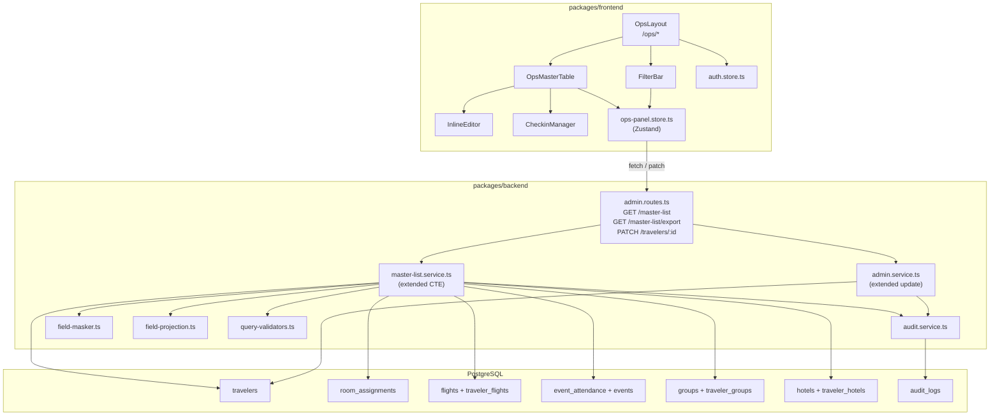

# Design Document: Admin Panel

## Overview

The Admin Panel extends the existing WSB 2027 frontend and backend to provide JBA operations staff with a dedicated operational tool at `/ops/*` routes. It replaces the basic admin pages at `/admin/*` with a purpose-built master table that surfaces all traveler fields from the 002 migration schema, supports inline cell editing, rich filtering, room/flight/event detail views, check-in management, CSV export, and audit-logged mutations.

The design touches three layers:

1. **Backend** — Extend `master-list.service.ts` SQL CTE to JOIN `room_assignments`, `flights` (by direction), and `event_attendance`. Add new filter/sort columns. Extend the existing `PATCH /api/v1/admin/travelers/:id` to accept all 002-schema fields and log granular audit entries.
2. **Shared types** — Extend `MasterListRow` with all new fields (room assignment object, arrival/departure flight objects, event attendance array, and scalar traveler columns from 002).
3. **Frontend** — New `/ops/*` route tree with `OpsLayout`, `OpsMasterTable`, `InlineEditor`, `FilterBar`, `CheckinManager` components and a dedicated `ops-panel.store.ts` Zustand store, fully isolated from the existing `/admin/*` pages.

### Key Design Decisions

- **Single extended CTE, not separate endpoints**: Room assignments, flights, and event attendance are joined into the master list CTE as nested JSON objects rather than requiring separate API calls. This keeps the table rendering simple and avoids N+1 fetches.
- **Reuse existing PATCH route**: The `PATCH /api/v1/admin/travelers/:id` endpoint already exists in `admin.routes.ts`. We extend `UpdateTravelerInput` to accept all 002-schema fields rather than creating a new endpoint. Audit logging is added inside the service layer.
- **Ops store is separate from master-list store**: The existing `master-list.store.ts` serves the `/admin/master-list` page. The ops panel gets its own `ops-panel.store.ts` to avoid coupling and to support inline editing state, expanded row state, and richer filter options.
- **PII masking reuses existing utilities**: `field-masker.ts` and `field-projection.ts` already handle masking and role-based projection. The design extends `applyMasking` to cover new PII-adjacent fields if needed, but the 002 fields (first_name, last_name, etc.) are not PII and pass through unmasked.

## Architecture



## Components and Interfaces

### Backend Components

#### 1. Extended Master List CTE (`master-list.service.ts`)

The existing `BASE_CTE` is extended with three new sub-CTEs:

- **`room_assignments_agg`** — LEFT JOINs `room_assignments` with `hotels` to produce a JSON object per traveler containing `room_number`, `room_assignment_seq`, `hotel_confirmation_no`, `occupancy`, `paid_room_type`, `preferred_roommates`, `is_paid_room`, and `hotel_name`.
- **`arrival_flight_agg`** — JOINs `traveler_flights` (WHERE `direction = 'arrival'`) with `flights` to produce a JSON object: `airline`, `flight_number`, `arrival_time`, `airport`, `terminal`.
- **`departure_flight_agg`** — Same as above but WHERE `direction = 'departure'`, producing `airline`, `flight_number`, `departure_time`, `airport`, `terminal`.
- **`event_attendance_agg`** — JOINs `event_attendance` with `events` to produce a JSON array of `{ event_name, fleet_number, attended }`.

The `SELECT_COLUMNS` string is extended to include all new traveler scalar columns from 002 (`first_name`, `last_name`, `gender`, `age`, `invitee_type`, `registration_type`, `pax_type`, `vip_tag`, `internal_id`, `agent_code`, `party_total`, `party_adults`, `party_children`, `dietary_vegan`, `dietary_notes`, `remarks`, `repeat_attendee`, `jba_repeat`, `checkin_status`, `onsite_flight_change`, `smd_name`, `ceo_name`, `photo_url`) plus the aggregated columns from the new CTEs.

The `buildWhereClause` function is extended to support new filter parameters: `invitee_type`, `pax_type`, `checkin_status`, `vip_tag`, `agent_code`.

The `ALLOWED_SORT_COLUMNS` in `query-validators.ts` is extended to include: `first_name`, `last_name`, `age`, `checkin_status`, `invitee_type`, `pax_type`, `vip_tag`, `internal_id`, `agent_code`.

#### 2. Extended PATCH Endpoint (`admin.service.ts`)

The existing `UpdateTravelerInput` interface is extended to accept all editable 002-schema fields:

```typescript
export interface UpdateTravelerInput {
  // Existing fields
  full_name?: string;
  email?: string;
  role_type?: RoleType;
  booking_id?: string;
  family_id?: string | null;
  guardian_id?: string | null;
  phone?: string | null;
  passport_name?: string | null;
  // New 002-schema fields
  first_name?: string;
  last_name?: string;
  gender?: 'male' | 'female' | 'other' | 'undisclosed';
  age?: number;
  invitee_type?: 'invitee' | 'guest';
  registration_type?: string;
  pax_type?: 'adult' | 'child' | 'infant';
  vip_tag?: string | null;
  internal_id?: string | null;
  agent_code?: string | null;
  party_total?: number | null;
  party_adults?: number | null;
  party_children?: number | null;
  dietary_vegan?: boolean;
  dietary_notes?: string | null;
  remarks?: string | null;
  checkin_status?: 'pending' | 'checked_in' | 'no_show';
  onsite_flight_change?: boolean;
  jba_repeat?: boolean;
  smd_name?: string | null;
  ceo_name?: string | null;
}
```

The `updateTraveler` function dynamically builds SET clauses for any provided field. Before executing the UPDATE, it fetches the current row to capture previous values for audit logging.

**Audit logging**: After a successful update, the service calls `auditService.logAuditEvent` with:
- `action_type`: `'traveler.field_update'` (or `'traveler.checkin_update'` when `checkin_status` changes)
- `entity_type`: `'traveler'`
- `entity_id`: the traveler UUID
- `details`: `{ field, previous_value, new_value }` for each changed field

#### 3. Extended Admin Routes (`admin.routes.ts`)

The existing `PATCH /api/v1/admin/travelers/:id` route handler is updated to:
1. Accept the extended `UpdateTravelerInput` body
2. Validate enum fields against allowed values
3. Call the extended `adminService.updateTraveler`
4. Return the updated traveler record

New query parameters for `GET /api/v1/admin/master-list`:
- `invitee_type` — filter by invitee/guest
- `pax_type` — filter by adult/child/infant
- `checkin_status` — filter by pending/checked_in/no_show
- `vip_tag` — filter by VIP tag value
- `agent_code` — filter by agent code

### Frontend Components

#### 1. OpsLayout (`packages/frontend/src/components/ops/OpsLayout.tsx`)

A layout wrapper for all `/ops/*` routes with:
- Sidebar navigation: Master Table, Rooms, Flights, Events, Audit Log
- Role guard: redirects non-admin/super_admin users to `/login`
- Header with "Unmask PII" toggle (visible only to `super_admin`)

```typescript
interface OpsLayoutProps {
  children: React.ReactNode;
}
```

#### 2. OpsMasterTable (`packages/frontend/src/pages/ops/OpsMasterTable.tsx`)

The main data table component:
- Renders all columns from the extended `MasterListRow`
- Horizontal scroll with sticky `first_name` + `last_name` columns
- Click-to-edit cells via `InlineEditor`
- Expandable rows for event attendance detail
- Pagination footer with page size selector
- Sort indicators on column headers

#### 3. InlineEditor (`packages/frontend/src/components/ops/InlineEditor.tsx`)

A cell-level editing component:

```typescript
interface InlineEditorProps {
  travelerId: string;
  field: string;
  value: unknown;
  fieldType: 'text' | 'number' | 'select' | 'checkbox';
  options?: { value: string; label: string }[];  // for select fields
  onSave: (field: string, value: unknown) => Promise<void>;
  onCancel: () => void;
}
```

Behavior:
- Renders appropriate input control based on `fieldType`
- Enter or blur triggers `onSave` → PATCH API call
- Escape triggers `onCancel` → restores original value
- Shows spinner during save, toast on error

#### 4. FilterBar (`packages/frontend/src/components/ops/FilterBar.tsx`)

Extended filter toolbar:

```typescript
interface FilterBarProps {
  filters: OpsFilters;
  onFilterChange: (key: string, value: string) => void;
  onClearAll: () => void;
  activeFilterCount: number;
}
```

Dropdowns for: group, sub-group, hotel, invitee_type, pax_type, checkin_status, vip_tag. Active filter count badge. "Clear All" button.

#### 5. CheckinManager (`packages/frontend/src/components/ops/CheckinManager.tsx`)

A status badge + dropdown component:

```typescript
interface CheckinManagerProps {
  travelerId: string;
  currentStatus: 'pending' | 'checked_in' | 'no_show';
  onStatusChange: (newStatus: string) => Promise<void>;
}
```

Color-coded badge: yellow (pending), green (checked_in), red (no_show). Click opens dropdown to change status.

#### 6. Ops Panel Store (`packages/frontend/src/stores/ops-panel.store.ts`)

```typescript
interface OpsFilters {
  group_id?: string;
  sub_group_id?: string;
  hotel_id?: string;
  invitee_type?: string;
  pax_type?: string;
  checkin_status?: string;
  vip_tag?: string;
  role_type?: string;
  access_status?: string;
}

interface OpsEditingCell {
  travelerId: string;
  field: string;
}

interface OpsPanelState {
  // Data
  data: ExtendedMasterListRow[];
  total: number;
  page: number;
  pageSize: number;
  totalPages: number;
  
  // Search & filters
  search: string;
  filters: OpsFilters;
  sortBy: string;
  sortOrder: 'asc' | 'desc';
  
  // UI state
  loading: boolean;
  error: string | null;
  editingCell: OpsEditingCell | null;
  expandedRows: Set<string>;
  unmaskPii: boolean;
  
  // Actions
  fetchData: () => Promise<void>;
  setPage: (page: number) => void;
  setPageSize: (size: number) => void;
  setSearch: (q: string) => void;
  setFilter: (key: string, value: string) => void;
  clearFilters: () => void;
  setSort: (column: string) => void;
  setEditingCell: (cell: OpsEditingCell | null) => void;
  toggleExpandedRow: (travelerId: string) => void;
  setUnmaskPii: (unmask: boolean) => void;
  patchTraveler: (id: string, field: string, value: unknown) => Promise<void>;
}
```

### Routing

New routes added to `App.tsx`:

```tsx
<Route path="/ops" element={<OpsLayout />}>
  <Route index element={<Navigate to="/ops/travelers" />} />
  <Route path="travelers" element={<OpsMasterTable />} />
  <Route path="rooms" element={<OpsRooms />} />
  <Route path="flights" element={<OpsFlights />} />
  <Route path="events" element={<OpsEvents />} />
  <Route path="audit" element={<OpsAuditLog />} />
</Route>
```

## Data Models

### Extended `MasterListRow` (shared types)

```typescript
export interface RoomAssignment {
  room_number: string | null;
  room_assignment_seq: number | null;
  hotel_confirmation_no: string | null;
  occupancy: 'single' | 'double' | 'twin' | 'triple' | null;
  paid_room_type: string | null;
  preferred_roommates: string | null;
  is_paid_room: boolean;
  hotel_name: string | null;
}

export interface FlightDetail {
  airline: string | null;
  flight_number: string;
  time: string;           // arrival_time or departure_time ISO string
  airport: string | null;
  terminal: string | null;
}

export interface EventAttendanceItem {
  event_name: string;
  fleet_number: string | null;
  attended: boolean | null;
}

export interface ExtendedMasterListRow extends MasterListRow {
  // New scalar fields from 002 migration
  first_name: string | null;
  last_name: string | null;
  gender: 'male' | 'female' | 'other' | 'undisclosed' | null;
  age: number | null;
  invitee_type: 'invitee' | 'guest' | null;
  registration_type: string | null;
  pax_type: 'adult' | 'child' | 'infant';
  vip_tag: string | null;
  internal_id: string | null;
  agent_code: string | null;
  party_total: number | null;
  party_adults: number | null;
  party_children: number | null;
  dietary_vegan: boolean;
  dietary_notes: string | null;
  remarks: string | null;
  repeat_attendee: number;
  jba_repeat: boolean;
  checkin_status: 'pending' | 'checked_in' | 'no_show';
  onsite_flight_change: boolean;
  smd_name: string | null;
  ceo_name: string | null;
  photo_url: string | null;
  
  // Structured related data (replaces flat arrays)
  room_assignment: RoomAssignment | null;
  arrival_flight: FlightDetail | null;
  departure_flight: FlightDetail | null;
  event_attendance: EventAttendanceItem[];
}
```

### Extended `MasterListQueryParams`

```typescript
export interface ExtendedMasterListQueryParams extends MasterListQueryParams {
  invitee_type?: 'invitee' | 'guest';
  pax_type?: 'adult' | 'child' | 'infant';
  checkin_status?: 'pending' | 'checked_in' | 'no_show';
  vip_tag?: string;
  agent_code?: string;
}
```

### Updated SQL CTE

```sql
WITH traveler_groups_agg AS (
  SELECT tg.traveler_id, array_agg(g.name ORDER BY g.name) AS groups
  FROM traveler_groups tg JOIN groups g ON tg.group_id = g.group_id
  GROUP BY tg.traveler_id
),
traveler_hotels_agg AS (
  SELECT th.traveler_id, array_agg(h.name ORDER BY h.name) AS hotels
  FROM traveler_hotels th JOIN hotels h ON th.hotel_id = h.hotel_id
  GROUP BY th.traveler_id
),
room_assignments_agg AS (
  SELECT ra.traveler_id,
         json_build_object(
           'room_number', ra.room_number,
           'room_assignment_seq', ra.room_assignment_seq,
           'hotel_confirmation_no', ra.hotel_confirmation_no,
           'occupancy', ra.occupancy,
           'paid_room_type', ra.paid_room_type,
           'preferred_roommates', ra.preferred_roommates,
           'is_paid_room', ra.is_paid_room,
           'hotel_name', h.name
         ) AS room_assignment
  FROM room_assignments ra
  JOIN hotels h ON ra.hotel_id = h.hotel_id
),
arrival_flight_agg AS (
  SELECT tf.traveler_id,
         json_build_object(
           'airline', f.airline,
           'flight_number', f.flight_number,
           'time', f.arrival_time,
           'airport', f.airport,
           'terminal', f.terminal
         ) AS arrival_flight
  FROM traveler_flights tf
  JOIN flights f ON tf.flight_id = f.flight_id
  WHERE tf.direction = 'arrival'
),
departure_flight_agg AS (
  SELECT tf.traveler_id,
         json_build_object(
           'airline', f.airline,
           'flight_number', f.flight_number,
           'time', f.departure_time,
           'airport', f.airport,
           'terminal', f.terminal
         ) AS departure_flight
  FROM traveler_flights tf
  JOIN flights f ON tf.flight_id = f.flight_id
  WHERE tf.direction = 'departure'
),
event_attendance_agg AS (
  SELECT ea.traveler_id,
         json_agg(
           json_build_object(
             'event_name', e.name,
             'fleet_number', ea.fleet_number,
             'attended', ea.attended
           ) ORDER BY e.date
         ) AS event_attendance
  FROM event_attendance ea
  JOIN events e ON ea.event_id = e.event_id
  GROUP BY ea.traveler_id
),
traveler_flights_agg AS (
  SELECT tf.traveler_id,
         json_agg(json_build_object(
           'flight_number', f.flight_number,
           'arrival_time', f.arrival_time
         ) ORDER BY f.arrival_time) AS flights
  FROM traveler_flights tf JOIN flights f ON tf.flight_id = f.flight_id
  GROUP BY tf.traveler_id
),
traveler_buses_agg AS (
  SELECT ba.traveler_id,
         json_agg(json_build_object(
           'bus_number', b.bus_number,
           'event_name', e.name
         ) ORDER BY e.date) AS bus_assignments
  FROM bus_assignments ba
  JOIN buses b ON ba.bus_id = b.bus_id
  JOIN events e ON ba.event_id = e.event_id
  GROUP BY ba.traveler_id
),
traveler_qr AS (
  SELECT traveler_id, bool_or(is_active) AS qr_active
  FROM qr_tokens
  GROUP BY traveler_id
)
SELECT
  t.traveler_id, t.booking_id, t.family_id, t.representative_id, t.guardian_id,
  t.full_name_raw, t.full_name_normalized, t.email_primary, t.email_aliases,
  t.passport_name, t.phone, t.role_type, t.access_status, t.created_at, t.updated_at,
  -- New 002 scalar columns
  t.first_name, t.last_name, t.gender, t.age, t.invitee_type, t.registration_type,
  t.pax_type, t.vip_tag, t.internal_id, t.agent_code,
  t.party_total, t.party_adults, t.party_children,
  t.dietary_vegan, t.dietary_notes, t.remarks,
  t.repeat_attendee, t.jba_repeat, t.checkin_status, t.onsite_flight_change,
  t.smd_name, t.ceo_name, t.photo_url,
  -- Aggregated columns
  COALESCE(tga.groups, '{}') AS groups,
  COALESCE(tha.hotels, '{}') AS hotels,
  raa.room_assignment,
  afa.arrival_flight,
  dfa.departure_flight,
  COALESCE(eaa.event_attendance, '[]'::json) AS event_attendance,
  COALESCE(tfa.flights, '[]'::json) AS flights,
  COALESCE(tba.bus_assignments, '[]'::json) AS bus_assignments,
  COALESCE(tqr.qr_active, false) AS qr_active
FROM travelers t
LEFT JOIN traveler_groups_agg tga ON t.traveler_id = tga.traveler_id
LEFT JOIN traveler_hotels_agg tha ON t.traveler_id = tha.traveler_id
LEFT JOIN room_assignments_agg raa ON t.traveler_id = raa.traveler_id
LEFT JOIN arrival_flight_agg afa ON t.traveler_id = afa.traveler_id
LEFT JOIN departure_flight_agg dfa ON t.traveler_id = dfa.traveler_id
LEFT JOIN event_attendance_agg eaa ON t.traveler_id = eaa.traveler_id
LEFT JOIN traveler_flights_agg tfa ON t.traveler_id = tfa.traveler_id
LEFT JOIN traveler_buses_agg tba ON t.traveler_id = tba.traveler_id
LEFT JOIN traveler_qr tqr ON t.traveler_id = tqr.traveler_id
```


## Correctness Properties

*A property is a characteristic or behavior that should hold true across all valid executions of a system — essentially, a formal statement about what the system should do. Properties serve as the bridge between human-readable specifications and machine-verifiable correctness guarantees.*

### Property 1: Role-based route guard rejects non-admin roles

*For any* role type that is not `admin` or `super_admin` (i.e., `traveler`, `minor`, `representative`, `staff`, `staff_desk`), when that user attempts to access any `/ops/*` route, the OpsLayout component should redirect to the login page and not render any operational content.

**Validates: Requirements 1.3**

### Property 2: Editable field type determines input control

*For any* editable field in the master table, the InlineEditor should render the correct input control based on the field's type classification: dropdown `<select>` for enum fields (`gender`, `invitee_type`, `pax_type`, `checkin_status`), `<input type="checkbox">` for boolean fields (`dietary_vegan`, `onsite_flight_change`, `jba_repeat`), `<input type="number">` for numeric fields (`age`, `party_total`, `party_adults`, `party_children`), and `<input type="text">` for all other string fields.

**Validates: Requirements 3.1, 3.7**

### Property 3: Edit cancellation restores original value

*For any* editable field and any original cell value, when editing is cancelled — either by pressing Escape or by a failed PATCH response — the cell content should revert to the exact original value that was displayed before editing began.

**Validates: Requirements 3.3, 3.5**

### Property 4: Search or filter change resets page to 1

*For any* search string or filter key-value change applied to the ops panel store, the `page` state should be reset to `1` regardless of what page was previously active.

**Validates: Requirements 4.3, 5.2**

### Property 5: Active filter count equals non-empty filter values

*For any* combination of filter values in the `OpsFilters` object (where each key may be set to a non-empty string or left undefined/empty), the computed active filter count should equal the number of filter keys that have a non-empty, non-undefined value.

**Validates: Requirements 5.4**

### Property 6: Multiple filters produce AND-joined WHERE conditions

*For any* subset of filter parameters (`invitee_type`, `pax_type`, `checkin_status`, `vip_tag`, `agent_code`, `role_type`, `access_status`, `group_id`, `hotel_id`) provided to `buildWhereClause`, the resulting SQL conditions array should contain exactly one condition per provided filter, and all conditions should be AND-joined in the final WHERE clause.

**Validates: Requirements 5.3**

### Property 7: Sort column validation accepts extended columns and rejects others

*For any* column name in the extended allowed sort list (`first_name`, `last_name`, `age`, `checkin_status`, `invitee_type`, `pax_type`, `vip_tag`, `internal_id`, `agent_code`, plus existing columns), `validateSortColumn` should return `true`. *For any* string not in the allowed list, `validateSortColumn` should return `false`.

**Validates: Requirements 6.5, 14.6**

### Property 8: Sort direction toggles on repeated column click

*For any* sortable column, if the current `sortBy` matches that column and `sortOrder` is `'asc'`, calling `setSort(column)` should change `sortOrder` to `'desc'`. If `sortOrder` is `'desc'`, it should change to `'asc'`. If `sortBy` does not match the column, it should set `sortBy` to the column and `sortOrder` to `'asc'`.

**Validates: Requirements 6.2**

### Property 9: Check-in status badge renders correct color class

*For any* `checkin_status` value (`pending`, `checked_in`, `no_show`), the CheckinManager badge should render with the corresponding CSS class: `badge-warning` for `pending`, `badge-success` for `checked_in`, `badge-danger` for `no_show`.

**Validates: Requirements 10.1**

### Property 10: Check-in status change produces correct audit entry

*For any* traveler ID and any (previous_status, new_status) pair where previous_status ≠ new_status, updating the `checkin_status` via the admin service should produce an audit log entry with `action_type` equal to `'traveler.checkin_update'`, `entity_type` equal to `'traveler'`, `entity_id` equal to the traveler's UUID, and `details` containing both the previous and new status values.

**Validates: Requirements 10.4, 12.3**

### Property 11: Field update produces audit entry with previous and new values

*For any* editable traveler field and any (previous_value, new_value) pair where previous_value ≠ new_value, updating the field via the admin service should produce an audit log entry with `action_type` equal to `'traveler.field_update'`, `entity_type` equal to `'traveler'`, `entity_id` equal to the traveler's UUID, and `details` containing the field name, previous value, and new value.

**Validates: Requirements 12.1**

### Property 12: Every audit entry contains actor_id and actor_role

*For any* audit log entry created by the admin panel (field updates, check-in changes, exports), the entry should have non-null `actor_id` and non-empty `actor_role` fields.

**Validates: Requirements 12.4**

### Property 13: CSV export row contains all extended fields

*For any* `ExtendedMasterListRow`, when formatted as a CSV line using the export service, the resulting CSV row should contain values for all extended schema columns including `first_name`, `last_name`, `gender`, `age`, `invitee_type`, `pax_type`, `vip_tag`, `internal_id`, `agent_code`, room assignment details, and flight details.

**Validates: Requirements 11.2**

### Property 14: Filter parameter produces corresponding WHERE condition

*For any* single extended filter parameter (`invitee_type`, `pax_type`, `checkin_status`, `vip_tag`, `agent_code`) with a non-empty value, `buildWhereClause` should produce a conditions array containing exactly one condition that references the corresponding database column with the provided value.

**Validates: Requirements 14.5**

## Error Handling

### Backend Error Handling

| Scenario | HTTP Status | Error Code | Behavior |
|---|---|---|---|
| Invalid sort column in query | 400 | `validation_error` | Return allowed columns list in message |
| Invalid enum value in PATCH body | 400 | `validation_error` | Return allowed values for the field |
| Traveler not found for PATCH | 404 | `not_found` | Return "Traveler not found" |
| Non-admin role accessing `/api/v1/admin/*` | 403 | `forbidden` | RBAC middleware rejects before route handler |
| Missing authentication token | 401 | `unauthorized` | Auth middleware rejects |
| Database connection failure | 500 | `server_error` | Generic error, no internal details leaked |
| Audit log write failure | 500 | `server_error` | Transaction rolls back, PATCH fails (fail-closed) |
| Invalid page/page_size parameters | 400 | `validation_error` | Return "page and page_size must be positive integers" |

### Frontend Error Handling

| Scenario | Behavior |
|---|---|
| PATCH request fails (network or 4xx/5xx) | InlineEditor reverts cell to original value, shows toast with error message |
| Master list fetch fails | Error banner with retry button, data table shows empty state |
| Session expired (401 response) | Redirect to login page |
| Forbidden (403 response) | Redirect to login page with "insufficient permissions" message |
| Export download fails | Toast notification with error message |

### Audit Logging Failure Mode

The system uses a **fail-closed** approach: if the audit log write fails, the entire operation (PATCH update) is rolled back. This ensures the audit trail is always complete. The audit entry is written within the same database transaction as the data mutation.

## Testing Strategy

### Unit Tests (Example-Based)

- **OpsLayout**: Renders sidebar with correct nav links; redirects non-admin roles
- **OpsMasterTable**: Renders all column headers; pagination controls work; empty state renders
- **InlineEditor**: Renders correct input type per field; Enter submits; Escape cancels; loading state shown during PATCH
- **FilterBar**: Renders all dropdowns; Clear All resets filters; active count badge
- **CheckinManager**: Renders color-coded badge; dropdown opens on click; status change triggers PATCH
- **admin.service.ts updateTraveler**: Handles each new field; returns not_found for missing traveler; validates enum values
- **master-list.service.ts**: Extended mapRow handles new fields; buildWhereClause handles new filters
- **query-validators.ts**: Extended ALLOWED_SORT_COLUMNS includes new columns

### Property-Based Tests (fast-check, minimum 100 iterations)

The project uses `fast-check` for property-based testing. Each property test references its design document property.

- **Property 1** — Generate random non-admin roles, verify OpsLayout guard behavior
  - Tag: `Feature: admin-panel, Property 1: Role-based route guard rejects non-admin roles`
- **Property 2** — Generate random editable field names, verify InlineEditor input type mapping
  - Tag: `Feature: admin-panel, Property 2: Editable field type determines input control`
- **Property 3** — Generate random field values, simulate cancel/failure, verify restoration
  - Tag: `Feature: admin-panel, Property 3: Edit cancellation restores original value`
- **Property 4** — Generate random page numbers and search/filter changes, verify page resets to 1
  - Tag: `Feature: admin-panel, Property 4: Search or filter change resets page to 1`
- **Property 5** — Generate random OpsFilters objects with varying populated keys, verify count
  - Tag: `Feature: admin-panel, Property 5: Active filter count equals non-empty filter values`
- **Property 6** — Generate random subsets of filter parameters, verify AND-joined conditions count
  - Tag: `Feature: admin-panel, Property 6: Multiple filters produce AND-joined WHERE conditions`
- **Property 7** — Generate random strings, verify validateSortColumn returns true for allowed, false for others
  - Tag: `Feature: admin-panel, Property 7: Sort column validation accepts extended columns and rejects others`
- **Property 8** — Generate random sortable columns and initial sort states, verify toggle behavior
  - Tag: `Feature: admin-panel, Property 8: Sort direction toggles on repeated column click`
- **Property 9** — Generate random checkin_status values, verify CSS class mapping
  - Tag: `Feature: admin-panel, Property 9: Check-in status badge renders correct color class`
- **Property 10** — Generate random (previous, new) status pairs, verify audit entry structure
  - Tag: `Feature: admin-panel, Property 10: Check-in status change produces correct audit entry`
- **Property 11** — Generate random field names and value pairs, verify audit entry details
  - Tag: `Feature: admin-panel, Property 11: Field update produces audit entry with previous and new values`
- **Property 12** — Generate random audit entries, verify actor_id and actor_role are always present
  - Tag: `Feature: admin-panel, Property 12: Every audit entry contains actor_id and actor_role`
- **Property 13** — Generate random ExtendedMasterListRow objects, verify CSV output contains all fields
  - Tag: `Feature: admin-panel, Property 13: CSV export row contains all extended fields`
- **Property 14** — Generate random filter parameter values, verify buildWhereClause output
  - Tag: `Feature: admin-panel, Property 14: Filter parameter produces corresponding WHERE condition`

### Integration Tests

- Master list endpoint returns extended fields when database has 002-schema data
- Room assignment CTE correctly joins and produces nested JSON
- Flight CTE separates arrival vs departure correctly
- Event attendance CTE produces correct array
- PATCH endpoint updates 002-schema fields and creates audit entries
- CSV export includes extended columns with correct masking
- New filter parameters (invitee_type, pax_type, checkin_status, vip_tag) produce correct SQL filtering

### Existing Tests (Already Covered)

The following properties are already covered by existing property tests and do not need new tests:
- PII masking behavior (`field-masker.property.test.ts`) — covers Requirements 13.1, 13.2
- Field projection by role (`field-projection.property.test.ts`) — covers Requirements 13.3, 13.4
- Sort column validation basics (`query-validators.property.test.ts`) — extended for new columns
- RBAC middleware rejection (`rbac.test.ts`) — covers Requirement 13.5
