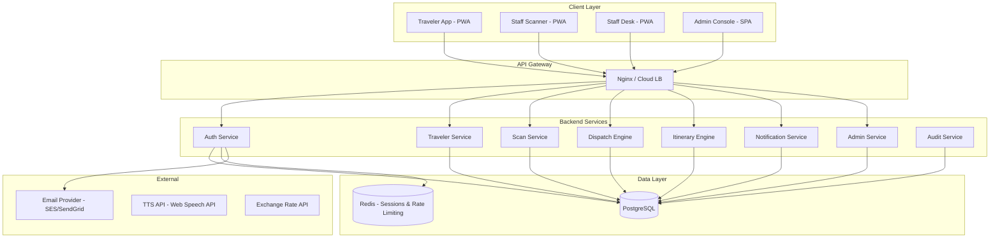
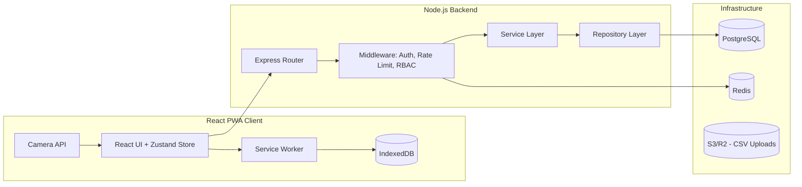
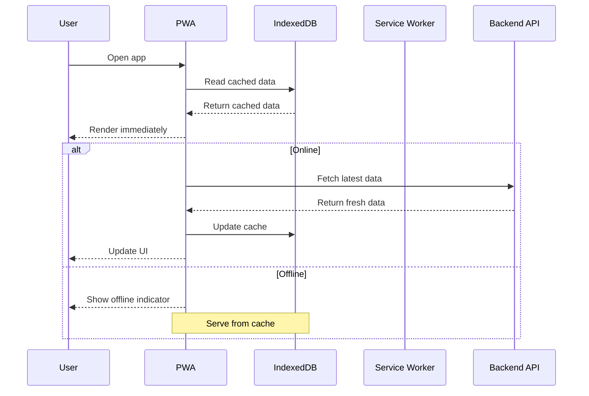
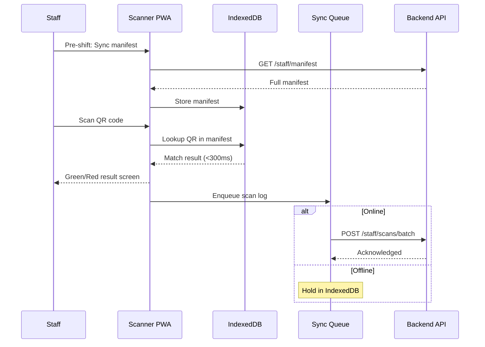
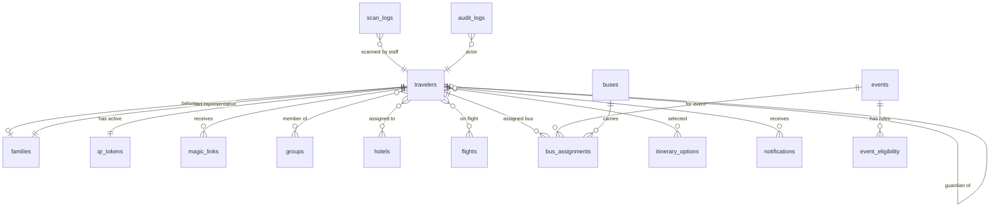

# Design Document: WSB 2027 China Digital Companion

## Overview

The WSB 2027 China Digital Companion is an installable PWA-first tour operations platform serving 3,000+ international travelers at the WSB 2027 China incentive event. The system provides fast identity access via QR codes, personalized itinerary delivery, family/minor management, offline-first staff scanning, and high-volume event logistics — all without app-store dependency.

### Key Design Decisions

| Decision | Choice | Rationale |
|---|---|---|
| Client Framework | React + Vite PWA | Fast build, tree-shaking, PWA-first with Workbox integration |
| State Management | Zustand | Lightweight, minimal boilerplate, works well with offline-first patterns |
| Local Storage | IndexedDB via `idb` wrapper | Structured data, large capacity, async API for offline persistence |
| Backend Runtime | Node.js / TypeScript | Shared types with frontend, strong async I/O for concurrent connections |
| Database | PostgreSQL 15+ | JSONB support, full-text search, robust referential integrity |
| Auth Model | Magic Link + Booking Lookup (passwordless) | No passwords to manage, link-first distribution model |
| Staff Validation | Manifest preload + local validation + deferred sync | Sub-300ms scan validation without network dependency |
| Mapping Layer | Provider abstraction (Apple Maps / Google Maps / Amap/Baidu-ready) | China requires local map providers; abstraction enables runtime switching |
| API Style | REST with versioned endpoints (`/api/v1/`) | Simple, cacheable, well-understood by all client types |
| Real-time | Server-Sent Events (SSE) for notifications | Simpler than WebSockets, sufficient for one-way push, works through proxies |

### System Boundaries



---

## Architecture

### High-Level Architecture

The system follows a modular monolith pattern deployed as a single Node.js process with logical service boundaries. This is appropriate for the event scale (3,500 travelers, 50 staff) and avoids microservice operational overhead.



### Layered Architecture (Backend)

```
┌─────────────────────────────────────────────┐
│  Routes / Controllers                        │  HTTP handling, request validation
├─────────────────────────────────────────────┤
│  Middleware                                   │  Auth, RBAC, rate limiting, audit
├─────────────────────────────────────────────┤
│  Service Layer                               │  Business logic, orchestration
├─────────────────────────────────────────────┤
│  Repository Layer                            │  Data access, query building
├─────────────────────────────────────────────┤
│  Database (PostgreSQL) + Cache (Redis)       │  Persistence, sessions, rate limits
└─────────────────────────────────────────────┘
```

### Client Architecture (PWA)

```
┌─────────────────────────────────────────────┐
│  React Components (Screens)                  │  UI rendering, user interaction
├─────────────────────────────────────────────┤
│  Zustand Stores                              │  Client state, offline state flags
├─────────────────────────────────────────────┤
│  API Client Layer                            │  Fetch wrapper, auth headers, retry
├─────────────────────────────────────────────┤
│  Sync Engine                                 │  Background sync, conflict resolution
├─────────────────────────────────────────────┤
│  IndexedDB (via idb)                         │  Offline cache, scan queue, manifest
├─────────────────────────────────────────────┤
│  Service Worker (Workbox)                    │  Asset caching, offline fallback
└─────────────────────────────────────────────┘
```

### Offline-First Data Flow



### Staff Scan Flow (Offline-First)



---


## Components and Interfaces

### Backend Service Components

#### 1. Auth Service

Handles magic link generation/verification, booking lookup, session management, and rate limiting.

```typescript
// POST /api/v1/auth/magic-link
interface MagicLinkRequest { email: string; }
interface MagicLinkResponse { success: boolean; }

// GET /api/v1/auth/magic-link/verify?token={token}
interface VerifyResponse {
  session_token: string;
  traveler_id: string;
  role_type: 'traveler' | 'minor' | 'representative' | 'staff';
}
interface VerifyError { error: 'expired' | 'used' | 'invalid'; }

// POST /api/v1/auth/booking-lookup
interface BookingLookupRequest { booking_id: string; last_name: string; }
interface BookingLookupResponse { session_token: string; traveler_id: string; }

// POST /api/v1/auth/refresh
interface RefreshResponse { session_token: string; expires_at: string; }

// POST /api/v1/auth/logout — 204 No Content
```

Key algorithms:
- Magic link token: `crypto.randomBytes(32).toString('urlsafe-base64')`
- Token expiry: 24 hours from creation
- Rate limiting: Redis sliding window — 5 requests per email per hour
- Name normalization: `trim → lowercase → NFD decompose → strip combining marks → collapse whitespace`

```typescript
function normalizeName(raw: string): string {
  return raw
    .trim()
    .toLowerCase()
    .normalize('NFD')
    .replace(/[\u0300-\u036f]/g, '')  // strip diacritics
    .replace(/\s+/g, ' ');            // collapse whitespace
}
```

#### 2. Traveler Service

Serves traveler profiles, QR tokens, family data, itineraries, and notifications.

```typescript
// GET /api/v1/travelers/me
interface TravelerProfile {
  traveler_id: string;
  full_name: string;
  email: string;
  role_type: RoleType;
  access_status: AccessStatus;
  family_id: string | null;
  group_ids: string[];
  hotel: { hotel_id: string; name: string; address_en: string; address_cn: string } | null;
  qr_token: string;
}

// GET /api/v1/travelers/me/family
interface FamilyResponse {
  family_id: string;
  members: Array<{
    traveler_id: string;
    full_name: string;
    role_type: RoleType;
    qr_token_value: string;
  }>;
}

// GET /api/v1/travelers/me/itinerary
interface ItineraryResponse {
  events: Array<{
    event_id: string;
    name: string;
    event_type: EventType;
    date: string;       // ISO date
    start_time: string; // ISO datetime
    end_time: string | null;
    location: string;
    description: string | null;
  }>;
}

// GET /api/v1/travelers/me/notifications
interface NotificationsResponse {
  notifications: Array<{
    notification_id: string;
    title: string;
    body: string;
    published_at: string;
    read_at: string | null;
  }>;
}

// PATCH /api/v1/travelers/me/notifications/{notification_id}/read — 204 No Content
```

Itinerary filtering algorithm:
```typescript
function filterItinerary(
  allEvents: Event[],
  traveler: { group_ids: string[]; option_ids: string[]; hotel_id: string | null }
): Event[] {
  return allEvents.filter(event => {
    const eligibility = event.eligibility; // from event_eligibility table
    if (eligibility.length === 0) return true; // no restrictions = everyone
    return eligibility.some(e =>
      (e.group_id && traveler.group_ids.includes(e.group_id)) ||
      (e.option_id && traveler.option_ids.includes(e.option_id)) ||
      (e.hotel_id && e.hotel_id === traveler.hotel_id)
    );
  });
}
```

#### 3. Scan Service

Handles manifest generation, delta sync, scan log ingestion, and scan mode management.

```typescript
// GET /api/v1/staff/manifest?mode={scan_mode}
interface ManifestResponse {
  travelers: Array<{
    qr_token_value: string;
    traveler_id: string;
    full_name: string;
    family_id: string | null;
    role_type: RoleType;
    eligibility: string[]; // array of scan_mode IDs this traveler is eligible for
  }>;
  version: string; // monotonic version for delta sync
}

// GET /api/v1/staff/manifest/delta?since_version={version}
// Same shape, only changed records

// POST /api/v1/staff/scans/batch
interface ScanBatchRequest {
  scans: Array<{
    qr_token_value: string;
    scan_mode: string;
    result: 'pass' | 'fail' | 'wrong_assignment' | 'override';
    override_reason?: string;
    device_id: string;
    scanned_at: string; // ISO datetime
  }>;
}

// GET /api/v1/staff/scan-modes
interface ScanModesResponse {
  modes: Array<{
    mode_id: string;
    name: string;
    event_id: string;
    event_type: EventType;
  }>;
}
```

Local manifest validation (client-side, <300ms):
```typescript
// Runs entirely in IndexedDB on staff device
function validateScan(
  qrToken: string,
  activeScanMode: string,
  manifest: Map<string, ManifestEntry>
): ScanResult {
  const entry = manifest.get(qrToken);
  if (!entry) return { result: 'fail', reason: 'unknown_qr' };
  if (!entry.eligibility.includes(activeScanMode)) {
    return {
      result: 'wrong_assignment',
      traveler: entry,
      reason: 'not_eligible_for_mode',
    };
  }
  return { result: 'pass', traveler: entry };
}
```

#### 4. Dispatch Engine

Auto-assigns travelers to buses based on flight times, terminal, and family grouping.

```typescript
// POST /api/v1/admin/dispatch/auto
interface DispatchRequest { event_id: string; }
interface DispatchProposal {
  proposed_assignments: Array<{
    traveler_id: string;
    bus_id: string;
    bus_number: string;
  }>;
}

// POST /api/v1/admin/dispatch/commit
interface DispatchCommitRequest {
  assignments: Array<{ traveler_id: string; bus_id: string }>;
}
```

Dispatch algorithm (pseudocode):
```
1. Fetch all travelers with flights for the target event
2. Sort flights by arrival_time DESC (reverse time-window)
3. Group travelers by terminal
4. Within each terminal group, cluster by 30-min arrival windows
5. For each cluster:
   a. Identify family groups (by family_id)
   b. Sort families by size DESC (place largest families first)
   c. Bin-pack families into buses respecting capacity (target 85-100%)
   d. Individual travelers fill remaining seats
6. Return proposed assignments for admin review
```

#### 5. Fuzzy Search Engine

Powers the staff rescue console with tolerant name/email matching.

```typescript
// GET /api/v1/staff/rescue/search?q={query}&type={name|email}
interface SearchResponse {
  candidates: Array<{
    traveler_id: string;
    full_name: string;
    email: string;
    booking_id: string;
    family_id: string | null;
    access_status: AccessStatus;
    match_score: number; // 0.0 - 1.0
  }>;
}
```

Search implementation:
- Name search: PostgreSQL `pg_trgm` extension with `similarity()` function on `full_name_normalized`
- Email search: `LIKE` prefix match on `email_primary` with `pg_trgm` fallback
- Minimum query length: 2 chars (name), 3 chars (email)
- Results ranked by `similarity()` score, top 20 returned
- Index: `CREATE INDEX idx_travelers_name_trgm ON travelers USING gin (full_name_normalized gin_trgm_ops);`

#### 6. Notification Service

Publishes targeted notifications via SSE and stores for offline retrieval.

```typescript
// POST /api/v1/admin/notifications
interface NotificationRequest {
  title: string;
  body: string;
  target_type: 'all' | 'group' | 'hotel' | 'bus' | 'individual';
  target_id?: string;
}

// SSE endpoint for real-time push
// GET /api/v1/notifications/stream (Authorization: Bearer {token})
// Emits: { notification_id, title, body, published_at }
```

Targeting resolution:
```typescript
async function resolveTargets(
  targetType: string,
  targetId: string | null
): Promise<string[]> { // returns traveler_ids
  switch (targetType) {
    case 'all': return getAllActiveTravelerIds();
    case 'group': return getTravelerIdsByGroup(targetId!);
    case 'hotel': return getTravelerIdsByHotel(targetId!);
    case 'bus': return getTravelerIdsByBus(targetId!);
    case 'individual': return [targetId!];
  }
}
```

#### 7. Admin Service

CRUD operations for travelers, groups, events, buses, hotels, CSV import, QR reissuance.

```typescript
// POST /api/v1/admin/import/travelers
interface ImportResponse {
  imported: number;
  errors: Array<{ row: number; field: string; reason: string }>;
}

// POST /api/v1/admin/qr/reissue
interface ReissueRequest { traveler_id: string; }
interface ReissueResponse { new_qr_token_value: string; }
```

CSV import validation pipeline:
```
1. Parse CSV with streaming parser (papaparse)
2. For each row:
   a. Validate required fields (full_name, email, role_type)
   b. Validate email format
   c. Validate role_type enum
   d. Validate guardian_id reference for minors
   e. Generate normalized_name
   f. Generate QR token
3. Collect errors per row without aborting
4. Bulk insert valid rows in a transaction
5. Return import summary with error details
```

#### 8. Audit Service

Cross-cutting concern that logs all operational actions.

```typescript
interface AuditEntry {
  actor_id: string;
  actor_role: string;
  action_type: string;
  entity_type: string;
  entity_id: string;
  details: Record<string, unknown>;
}

// Implemented as middleware + explicit service calls
// GET /api/v1/admin/audit-logs?start_date=&end_date=&action_type=&actor_id=&traveler_id=
interface AuditLogResponse {
  entries: Array<{
    audit_id: string;
    actor_id: string;
    actor_role: string;
    action_type: string;
    entity_type: string;
    entity_id: string;
    details: Record<string, unknown>;
    created_at: string;
  }>;
  total: number;
  page: number;
  page_size: number;
}
```

### Client Components

#### PWA Screens (React Components)

| Screen | Route | Role Access | Key Features |
|---|---|---|---|
| Login | `/login` | Public | Email input, magic link request, booking lookup tab |
| Home | `/` | Traveler, Representative | Greeting, QR card, next event, notifications badge, family wallet card |
| QR Display | `/qr` | Traveler, Representative | Full-screen QR, name, max brightness, no sleep |
| Family Wallet | `/family` | Representative | Member list, slideshow mode, swipe navigation |
| Itinerary | `/itinerary` | Traveler, Representative | Timeline by date, pull-to-refresh, offline banner |
| Notifications | `/notifications` | Traveler, Representative | Notification list, unread badge, mark-as-read |
| Toolkit Hub | `/toolkit` | Traveler, Representative | Cards: Taxi, Phrasebook, Currency, Emergency |
| Taxi Card | `/toolkit/taxi` | Traveler, Representative | Bilingual hotel address, large text |
| Phrasebook | `/toolkit/phrasebook` | Traveler, Representative | Categorized phrases, TTS playback |
| Currency Converter | `/toolkit/currency` | Traveler, Representative | CNY↔USD, cached rate, rate date |
| Staff Scanner | `/staff/scan` | Staff | Camera viewfinder, scan mode header, result overlays |
| Staff Rescue | `/staff/rescue` | Staff Desk | Search bar, candidate list, profile expand, actions |
| Admin Dashboard | `/admin` | Admin, Super Admin | Summary cards, scan feed, bus chart, navigation |
| Admin Travelers | `/admin/travelers` | Admin | CRUD table, CSV import, family linking |
| Admin Groups | `/admin/groups` | Admin | CRUD, assignment management |
| Admin Events | `/admin/events` | Admin | CRUD, eligibility rules |
| Admin Dispatch | `/admin/dispatch` | Admin | Auto-dispatch trigger, review, commit |
| Admin Notifications | `/admin/notifications` | Admin | Compose, target, publish |
| Admin Audit | `/admin/audit` | Admin | Searchable log viewer |

### Middleware Stack

```typescript
// Applied in order on every request
const middlewareStack = [
  corsMiddleware,          // CORS headers
  helmetMiddleware,        // Security headers
  rateLimitMiddleware,     // Redis-backed sliding window
  authMiddleware,          // JWT verification, session lookup
  rbacMiddleware,          // Role-based access control
  requestLogMiddleware,    // Request logging
  auditMiddleware,         // Audit trail for mutations
];
```

### RBAC Matrix

| Endpoint Group | Traveler | Representative | Staff | Staff Desk | Admin | Super Admin |
|---|---|---|---|---|---|---|
| `/auth/*` | ✅ | ✅ | ✅ | ✅ | ✅ | ✅ |
| `/travelers/me/*` | ✅ | ✅ | ❌ | ❌ | ❌ | ❌ |
| `/travelers/me/family` | ❌ | ✅ | ❌ | ❌ | ❌ | ❌ |
| `/staff/manifest` | ❌ | ❌ | ✅ | ❌ | ❌ | ❌ |
| `/staff/scans/*` | ❌ | ❌ | ✅ | ❌ | ❌ | ❌ |
| `/staff/rescue/*` | ❌ | ❌ | ❌ | ✅ | ✅ | ✅ |
| `/admin/*` | ❌ | ❌ | ❌ | ❌ | ✅ | ✅ |
| `/notifications/stream` | ✅ | ✅ | ❌ | ❌ | ❌ | ❌ |

---


## Data Models

### PostgreSQL Database Schema

#### Entity Relationship Diagram



#### Core Tables — DDL

```sql
-- Extensions
CREATE EXTENSION IF NOT EXISTS "uuid-ossp";
CREATE EXTENSION IF NOT EXISTS "pg_trgm";
CREATE EXTENSION IF NOT EXISTS "pgcrypto";

-- Enums
CREATE TYPE role_type AS ENUM ('traveler', 'minor', 'representative', 'staff', 'staff_desk', 'admin', 'super_admin');
CREATE TYPE access_status AS ENUM ('invited', 'activated', 'linked', 'rescued');
CREATE TYPE event_type AS ENUM ('bus', 'meal', 'activity', 'ceremony', 'transfer', 'hotel_checkin');
CREATE TYPE scan_result AS ENUM ('pass', 'fail', 'wrong_assignment', 'override');
CREATE TYPE notification_target AS ENUM ('all', 'group', 'hotel', 'bus', 'individual');

-- Identity & Access
CREATE TABLE families (
    family_id       UUID PRIMARY KEY DEFAULT uuid_generate_v4(),
    representative_id UUID NOT NULL,  -- FK added after travelers table
    created_at      TIMESTAMPTZ NOT NULL DEFAULT NOW()
);

CREATE TABLE travelers (
    traveler_id         UUID PRIMARY KEY DEFAULT uuid_generate_v4(),
    booking_id          VARCHAR(64),
    family_id           UUID REFERENCES families(family_id),
    representative_id   UUID REFERENCES travelers(traveler_id),
    guardian_id          UUID REFERENCES travelers(traveler_id),
    full_name_raw       VARCHAR(255) NOT NULL,
    full_name_normalized VARCHAR(255) NOT NULL,
    email_primary       VARCHAR(255) NOT NULL UNIQUE,
    email_aliases       VARCHAR(255)[],
    passport_name       VARCHAR(255),
    phone               VARCHAR(64),
    role_type           role_type NOT NULL DEFAULT 'traveler',
    access_status       access_status NOT NULL DEFAULT 'invited',
    created_at          TIMESTAMPTZ NOT NULL DEFAULT NOW(),
    updated_at          TIMESTAMPTZ NOT NULL DEFAULT NOW()
);

ALTER TABLE families
    ADD CONSTRAINT fk_families_representative
    FOREIGN KEY (representative_id) REFERENCES travelers(traveler_id);

CREATE INDEX idx_travelers_booking ON travelers(booking_id);
CREATE INDEX idx_travelers_family ON travelers(family_id);
CREATE INDEX idx_travelers_email ON travelers(email_primary);
CREATE INDEX idx_travelers_name_normalized ON travelers(full_name_normalized);
CREATE INDEX idx_travelers_name_trgm ON travelers USING gin (full_name_normalized gin_trgm_ops);

CREATE TABLE qr_tokens (
    token_id    UUID PRIMARY KEY DEFAULT uuid_generate_v4(),
    traveler_id UUID NOT NULL UNIQUE REFERENCES travelers(traveler_id),
    token_value VARCHAR(128) NOT NULL UNIQUE,
    token_hash  VARCHAR(64) NOT NULL,  -- SHA-256 hash for audit
    is_active   BOOLEAN NOT NULL DEFAULT true,
    issued_at   TIMESTAMPTZ NOT NULL DEFAULT NOW(),
    revoked_at  TIMESTAMPTZ
);

CREATE INDEX idx_qr_tokens_value ON qr_tokens(token_value);
CREATE INDEX idx_qr_tokens_traveler ON qr_tokens(traveler_id);

CREATE TABLE magic_links (
    link_id     UUID PRIMARY KEY DEFAULT uuid_generate_v4(),
    traveler_id UUID NOT NULL REFERENCES travelers(traveler_id),
    token       VARCHAR(128) NOT NULL UNIQUE,
    expires_at  TIMESTAMPTZ NOT NULL,
    used_at     TIMESTAMPTZ,
    created_at  TIMESTAMPTZ NOT NULL DEFAULT NOW()
);

CREATE INDEX idx_magic_links_token ON magic_links(token);

-- Operations & Assignments
CREATE TABLE groups (
    group_id    UUID PRIMARY KEY DEFAULT uuid_generate_v4(),
    name        VARCHAR(128) NOT NULL,
    description TEXT,
    created_at  TIMESTAMPTZ NOT NULL DEFAULT NOW()
);

CREATE TABLE traveler_groups (
    traveler_id UUID REFERENCES travelers(traveler_id) ON DELETE CASCADE,
    group_id    UUID REFERENCES groups(group_id) ON DELETE CASCADE,
    PRIMARY KEY (traveler_id, group_id)
);

CREATE TABLE hotels (
    hotel_id    UUID PRIMARY KEY DEFAULT uuid_generate_v4(),
    name        VARCHAR(255) NOT NULL,
    address_en  VARCHAR(512),
    address_cn  VARCHAR(512),
    created_at  TIMESTAMPTZ NOT NULL DEFAULT NOW()
);

CREATE TABLE traveler_hotels (
    traveler_id UUID REFERENCES travelers(traveler_id) ON DELETE CASCADE,
    hotel_id    UUID REFERENCES hotels(hotel_id) ON DELETE CASCADE,
    PRIMARY KEY (traveler_id, hotel_id)
);

CREATE TABLE events (
    event_id    UUID PRIMARY KEY DEFAULT uuid_generate_v4(),
    name        VARCHAR(255) NOT NULL,
    event_type  event_type NOT NULL,
    date        DATE NOT NULL,
    start_time  TIMESTAMPTZ,
    end_time    TIMESTAMPTZ,
    location    VARCHAR(512),
    description TEXT,
    created_at  TIMESTAMPTZ NOT NULL DEFAULT NOW()
);

CREATE TABLE event_eligibility (
    event_id    UUID REFERENCES events(event_id) ON DELETE CASCADE,
    group_id    UUID REFERENCES groups(group_id),
    hotel_id    UUID REFERENCES hotels(hotel_id),
    option_id   UUID,  -- FK to itinerary_options
    PRIMARY KEY (event_id, COALESCE(group_id, hotel_id, option_id))
);

CREATE TABLE itinerary_options (
    option_id   UUID PRIMARY KEY DEFAULT uuid_generate_v4(),
    name        VARCHAR(255) NOT NULL,
    description TEXT,
    created_at  TIMESTAMPTZ NOT NULL DEFAULT NOW()
);

CREATE TABLE traveler_options (
    traveler_id UUID REFERENCES travelers(traveler_id) ON DELETE CASCADE,
    option_id   UUID REFERENCES itinerary_options(option_id) ON DELETE CASCADE,
    PRIMARY KEY (traveler_id, option_id)
);

CREATE TABLE buses (
    bus_id          UUID PRIMARY KEY DEFAULT uuid_generate_v4(),
    bus_number      VARCHAR(32) NOT NULL UNIQUE,
    capacity        INTEGER NOT NULL,
    event_id        UUID REFERENCES events(event_id),
    departure_time  TIMESTAMPTZ,
    terminal        VARCHAR(64),
    created_at      TIMESTAMPTZ NOT NULL DEFAULT NOW()
);

CREATE TABLE bus_assignments (
    assignment_id UUID PRIMARY KEY DEFAULT uuid_generate_v4(),
    traveler_id   UUID NOT NULL REFERENCES travelers(traveler_id),
    bus_id        UUID NOT NULL REFERENCES buses(bus_id),
    event_id      UUID NOT NULL REFERENCES events(event_id),
    assigned_at   TIMESTAMPTZ NOT NULL DEFAULT NOW()
);

CREATE INDEX idx_bus_assignments_traveler ON bus_assignments(traveler_id);

CREATE TABLE flights (
    flight_id       UUID PRIMARY KEY DEFAULT uuid_generate_v4(),
    flight_number   VARCHAR(32) NOT NULL,
    arrival_time    TIMESTAMPTZ NOT NULL,
    terminal        VARCHAR(64),
    created_at      TIMESTAMPTZ NOT NULL DEFAULT NOW()
);

CREATE TABLE traveler_flights (
    traveler_id UUID REFERENCES travelers(traveler_id) ON DELETE CASCADE,
    flight_id   UUID REFERENCES flights(flight_id) ON DELETE CASCADE,
    PRIMARY KEY (traveler_id, flight_id)
);

-- Notifications
CREATE TABLE notifications (
    notification_id UUID PRIMARY KEY DEFAULT uuid_generate_v4(),
    title           VARCHAR(255) NOT NULL,
    body            TEXT NOT NULL,
    target_type     notification_target NOT NULL,
    target_id       UUID,
    published_at    TIMESTAMPTZ,
    created_by      UUID REFERENCES travelers(traveler_id)
);

CREATE TABLE traveler_notifications (
    traveler_id     UUID REFERENCES travelers(traveler_id) ON DELETE CASCADE,
    notification_id UUID REFERENCES notifications(notification_id) ON DELETE CASCADE,
    read_at         TIMESTAMPTZ,
    PRIMARY KEY (traveler_id, notification_id)
);

-- Scan Logs
CREATE TABLE scan_logs (
    log_id          UUID PRIMARY KEY DEFAULT uuid_generate_v4(),
    staff_id        UUID NOT NULL REFERENCES travelers(traveler_id),
    qr_token_value  VARCHAR(128) NOT NULL,
    scan_mode       VARCHAR(128) NOT NULL,
    result          scan_result NOT NULL,
    override_reason VARCHAR(255),
    device_id       VARCHAR(128),
    scanned_at      TIMESTAMPTZ NOT NULL,
    synced_at       TIMESTAMPTZ
);

CREATE INDEX idx_scan_logs_staff ON scan_logs(staff_id);
CREATE INDEX idx_scan_logs_token ON scan_logs(qr_token_value);
CREATE INDEX idx_scan_logs_scanned ON scan_logs(scanned_at);

-- Audit Logs
CREATE TABLE audit_logs (
    audit_id    UUID PRIMARY KEY DEFAULT uuid_generate_v4(),
    actor_id    UUID NOT NULL REFERENCES travelers(traveler_id),
    actor_role  VARCHAR(32) NOT NULL,
    action_type VARCHAR(64) NOT NULL,
    entity_type VARCHAR(64) NOT NULL,
    entity_id   UUID,
    details     JSONB,
    created_at  TIMESTAMPTZ NOT NULL DEFAULT NOW()
);

CREATE INDEX idx_audit_logs_action ON audit_logs(action_type);
CREATE INDEX idx_audit_logs_created ON audit_logs(created_at);
CREATE INDEX idx_audit_logs_actor ON audit_logs(actor_id);
```

### IndexedDB Schema (Client-Side)

```typescript
// idb schema definition
const DB_NAME = 'wsb-companion';
const DB_VERSION = 1;

interface CompanionDB {
  // Traveler data cache
  profile: { key: 'me'; value: TravelerProfile };
  qrToken: { key: 'me'; value: { token_value: string; traveler_name: string } };
  familyMembers: { key: string; value: FamilyMember; indexes: { 'by-family': string } };
  itinerary: { key: string; value: ItineraryEvent; indexes: { 'by-date': string } };
  notifications: { key: string; value: Notification; indexes: { 'by-published': string } };

  // Toolkit cache
  taxiCard: { key: 'me'; value: { hotel_name_en: string; hotel_name_cn: string; address_en: string; address_cn: string } };
  phrasebook: { key: string; value: Phrase; indexes: { 'by-category': string } };
  exchangeRate: { key: 'latest'; value: { rate: number; fetched_at: string } };

  // Staff data
  manifest: { key: string; value: ManifestEntry; indexes: { 'by-token': string } };
  manifestMeta: { key: 'meta'; value: { version: string; synced_at: string; count: number } };
  scanQueue: { key: string; value: ScanLogEntry; indexes: { 'by-synced': number } };

  // Sync metadata
  syncMeta: { key: string; value: { last_synced: string; entity: string } };
}
```

### Manifest Data Structure (Staff Device)

The manifest is stored as a `Map<string, ManifestEntry>` in IndexedDB for O(1) QR lookup:

```typescript
interface ManifestEntry {
  qr_token_value: string;  // key for Map lookup
  traveler_id: string;
  full_name: string;
  family_id: string | null;
  role_type: RoleType;
  eligibility: string[];   // array of scan_mode IDs
}

// On sync, build lookup map:
const manifest = new Map<string, ManifestEntry>();
for (const entry of manifestData.travelers) {
  manifest.set(entry.qr_token_value, entry);
}
// Store in IndexedDB for persistence across app restarts
```

### Session Token Structure (JWT)

```typescript
interface SessionPayload {
  sub: string;        // traveler_id
  role: RoleType;
  family_id?: string;
  iat: number;
  exp: number;        // 24h max lifetime
}
```

---


## Correctness Properties

*A property is a characteristic or behavior that should hold true across all valid executions of a system — essentially, a formal statement about what the system should do. Properties serve as the bridge between human-readable specifications and machine-verifiable correctness guarantees.*

### Property 1: Traveler serialization round-trip

*For any* valid Traveler record, serializing to JSON and deserializing back SHALL produce an equivalent Traveler object with all fields preserved.

**Validates: Requirements 46.1**

### Property 2: QR encoding round-trip

*For any* valid QR_Token string, encoding to QR image data and decoding back SHALL produce the original token string.

**Validates: Requirements 46.2**

### Property 3: Manifest serialization round-trip

*For any* valid Manifest object (containing traveler entries with QR tokens, eligibility arrays, and family data), serializing for IndexedDB storage and deserializing back SHALL produce an equivalent Manifest object.

**Validates: Requirements 46.3**

### Property 4: CSV parse/format round-trip

*For any* valid CSV row conforming to the traveler import schema, parsing to a Traveler object and formatting back to CSV SHALL produce a row equivalent to the original input.

**Validates: Requirements 46.5, 17.1**

### Property 5: Name normalization idempotence

*For any* string input, applying the normalization function (trim, lowercase, strip diacritics, collapse whitespace) twice SHALL produce the same result as applying it once: `normalize(normalize(s)) === normalize(s)`.

**Validates: Requirements 2.3, 47.6**

### Property 6: Magic link single-use enforcement

*For any* valid Magic_Link token, verifying the token a first time SHALL succeed, and verifying the same token a second time SHALL be rejected with an "already used" error.

**Validates: Requirements 1.4, 48.6**

### Property 7: Magic link expiry enforcement

*For any* Magic_Link token with a creation timestamp older than 24 hours, verification SHALL be rejected with an "expired" error. *For any* token with a creation timestamp within 24 hours and not yet used, verification SHALL succeed.

**Validates: Requirements 1.3**

### Property 8: Auth response uniformity

*For any* email address (whether it exists in the database or not), the magic link request endpoint SHALL return an identical response shape `{ success: true }` with status 200. *For any* booking lookup with mismatched credentials, the error response SHALL be `{ error: "invalid_credentials" }` regardless of which field is incorrect.

**Validates: Requirements 1.5, 2.2**

### Property 9: Rate limiting enforcement

*For any* email address, after exactly 5 magic link requests within a 1-hour window, subsequent requests SHALL be rate-limited until the window expires.

**Validates: Requirements 1.6**

### Property 10: Family representative uniqueness invariant

*For any* Family_ID in the system, there SHALL be exactly one member with the representative role. Creating a family without a representative, or adding a second representative, SHALL be rejected.

**Validates: Requirements 4.2, 47.1**

### Property 11: Minor single guardian invariant

*For any* Minor_Dependent, the system SHALL prevent linking to more than one guardian_id simultaneously. The guardian_id SHALL reference a valid Traveler with role_type "traveler" or "representative".

**Validates: Requirements 4.6, 47.2**

### Property 12: Minor QR accessible through guardian

*For any* Minor_Dependent linked to a guardian via guardian_id, querying the guardian's family wallet endpoint SHALL include the minor's QR_Token in the response members list.

**Validates: Requirements 4.4**

### Property 13: Active QR token uniqueness after reissuance

*For any* Traveler, after QR token reissuance, there SHALL be exactly one active QR_Token for that traveler. The previously active token SHALL have `is_active = false` and `revoked_at` set. Scanning the old token SHALL result in a "Token Revoked" rejection.

**Validates: Requirements 22.1, 22.2, 22.5, 47.3**

### Property 14: Itinerary filtering correctness

*For any* Traveler with specific group_ids, option_ids, and hotel_id assignments, and *for any* set of events with eligibility rules, the filtered itinerary SHALL contain only events where at least one eligibility rule matches the traveler's assignments. Events with no eligibility rules SHALL be included for all travelers.

**Validates: Requirements 7.1, 7.2**

### Property 15: Itinerary filter idempotence

*For any* valid itinerary event list and filter criteria, applying the filter twice SHALL produce the same result as applying it once. Additionally, the union of filtered results across all possible traveler assignment combinations SHALL equal the original event set.

**Validates: Requirements 46.4**

### Property 16: Local scan validation correctness

*For any* QR token string and *for any* manifest and active scan mode: if the token exists in the manifest AND the traveler's eligibility array contains the active scan mode, validation SHALL return "pass". If the token exists but eligibility does not include the scan mode, validation SHALL return "wrong_assignment". If the token does not exist in the manifest, validation SHALL return "fail".

**Validates: Requirements 12.2, 13.1, 14.1, 48.4**

### Property 17: Batch family check-in correctness

*For any* Family_Representative's QR token scanned in batch mode, and *for any* active scan mode, the batch result SHALL list all linked family members. Each member SHALL be marked eligible if and only if their individual eligibility array contains the active scan mode. The check-in count SHALL equal the number of eligible members.

**Validates: Requirements 15.1, 15.2, 15.3, 15.4**

### Property 18: Override reason completeness invariant

*For any* scan event with result "override", the override_reason field SHALL be non-null, non-empty, and SHALL be one of the predefined reason codes.

**Validates: Requirements 16.2, 16.3, 48.5**

### Property 19: Dispatch family preservation invariant

*For any* set of travelers with family groups and *for any* dispatch output, all members sharing a Family_ID SHALL be assigned to the same bus_id.

**Validates: Requirements 19.3, 47.4**

### Property 20: Dispatch capacity invariant

*For any* dispatch output, the count of travelers assigned to each bus SHALL not exceed that bus's capacity.

**Validates: Requirements 19.2, 47.5**

### Property 21: Dispatch monotonic bus count

*For any* valid dispatch input, adding one additional Traveler to the input SHALL not decrease the total number of buses used in the output.

**Validates: Requirements 48.3**

### Property 22: Fuzzy search exact recall

*For any* Traveler in the database, searching for their exact `full_name_normalized` SHALL always include that Traveler in the results. Searching for any prefix of their `email_primary` (length >= 3) SHALL include that Traveler in the results.

**Validates: Requirements 3.1, 3.2, 48.2**

### Property 23: Fuzzy search monotonic refinement

*For any* search query string `q` that returns results, appending any additional character to form `q + c` SHALL return a result set that is a subset of or equal to the result set for `q`.

**Validates: Requirements 48.1**

### Property 24: Currency conversion round-trip

*For any* positive numeric amount and *for any* valid exchange rate, converting from CNY to USD and back to CNY SHALL produce a value within floating-point tolerance (±0.01) of the original amount.

**Validates: Requirements 11.1, 11.2**

---


## Error Handling

### Backend Error Strategy

All API errors follow a consistent envelope:

```typescript
interface ApiError {
  error: string;       // machine-readable error code
  message: string;     // human-readable description
  details?: unknown;   // optional structured details (validation errors, etc.)
}
```

#### HTTP Status Code Mapping

| Status | Usage |
|---|---|
| 200 | Success (GET, PATCH) |
| 201 | Created (POST creating resources) |
| 204 | No Content (DELETE, mark-as-read) |
| 400 | Validation error, malformed request |
| 401 | Missing or invalid session token |
| 403 | Insufficient role permissions (RBAC) |
| 404 | Resource not found |
| 409 | Conflict (duplicate email, double-use magic link) |
| 422 | Business rule violation (minor without guardian, duplicate representative) |
| 429 | Rate limited |
| 500 | Internal server error |

#### Auth Error Handling

- Magic link request: Always returns `{ success: true }` with 200, even for non-existent emails (prevents enumeration)
- Magic link verify: Returns specific error codes (`expired`, `used`, `invalid`) so the client can show appropriate UI
- Booking lookup: Returns generic `invalid_credentials` for any mismatch (prevents field enumeration)
- Rate limiting: Returns 429 with `Retry-After` header

#### CSV Import Error Handling

- Row-level validation errors are collected without aborting the import
- Each error includes: `{ row: number, field: string, reason: string }`
- Valid rows are imported in a transaction; if the transaction fails, all rows are rolled back
- The response includes both `imported` count and `errors` array

#### Scan Validation Error Handling (Client-Side)

- Unknown QR: Red screen with "Unknown QR — Contact Staff"
- Wrong assignment: Red screen with "WRONG ASSIGNMENT" + correct assignment info
- Revoked token: Red screen with "Token Revoked — Contact Staff"
- Manifest not loaded: Block scanning, show "Sync Required" prompt
- Manifest stale (>4 hours): Warning banner, allow scanning but prompt re-sync

#### Offline Error Handling

- Network requests that fail while offline are silently queued (scan logs) or skipped (data fetches)
- The UI shows an offline indicator in the navigation bar
- Cached data is served without error screens
- When connectivity returns, the sync engine processes the queue in order
- Sync conflicts (e.g., QR token reissued while offline) are resolved by server-wins strategy

#### Dispatch Engine Error Handling

- If no buses have sufficient remaining capacity for a family group, the dispatch returns an error for that family and continues with remaining travelers
- If flight data is missing for a traveler, they are placed in an "unassigned" bucket for manual review
- The proposed assignments are always presented for admin review before committing

### Client Error Boundaries

```typescript
// React error boundary wrapping each screen
// Catches render errors and shows a fallback UI
// Logs errors to a local error store for debugging
// Does NOT crash the entire app — other screens remain functional

// Network error retry strategy:
const RETRY_CONFIG = {
  maxRetries: 3,
  baseDelay: 1000,    // 1 second
  maxDelay: 10000,    // 10 seconds
  backoffFactor: 2,   // exponential backoff
};
```

---

## Testing Strategy

### Testing Pyramid

```
         ┌──────────┐
         │   E2E    │  Playwright: critical user flows (5-10 tests)
         ├──────────┤
        │Integration │  API tests with real DB (per endpoint group)
        ├────────────┤
       │  Property    │  fast-check: 24 properties × 100+ iterations
       ├──────────────┤
      │   Unit Tests   │  Vitest: service logic, utilities, components
      └────────────────┘
```

### Property-Based Testing

Library: **fast-check** (TypeScript, integrates with Vitest)

Configuration:
- Minimum 100 iterations per property
- Each test tagged with: `Feature: wsb-2027-china-companion, Property {N}: {title}`
- Seed logging enabled for reproducibility

Property test organization:
```
tests/
  properties/
    serialization.property.test.ts    # Properties 1, 3, 4
    qr-encoding.property.test.ts      # Property 2
    normalization.property.test.ts     # Property 5
    auth.property.test.ts             # Properties 6, 7, 8, 9
    family.property.test.ts           # Properties 10, 11, 12
    qr-token.property.test.ts         # Property 13
    itinerary.property.test.ts        # Properties 14, 15
    scanning.property.test.ts         # Properties 16, 17, 18
    dispatch.property.test.ts         # Properties 19, 20, 21
    search.property.test.ts           # Properties 22, 23
    currency.property.test.ts         # Property 24
```

Custom generators needed:
```typescript
// Traveler generator
const arbTraveler = fc.record({
  traveler_id: fc.uuid(),
  booking_id: fc.string({ minLength: 4, maxLength: 20 }),
  full_name_raw: fc.string({ minLength: 2, maxLength: 100 }),
  email_primary: fc.emailAddress(),
  role_type: fc.constantFrom('traveler', 'minor', 'representative', 'staff'),
  // ...
});

// Manifest entry generator
const arbManifestEntry = fc.record({
  qr_token_value: fc.hexaString({ minLength: 32, maxLength: 64 }),
  traveler_id: fc.uuid(),
  full_name: fc.string({ minLength: 2, maxLength: 100 }),
  family_id: fc.option(fc.uuid()),
  role_type: fc.constantFrom('traveler', 'minor', 'representative'),
  eligibility: fc.array(fc.string({ minLength: 3, maxLength: 20 }), { minLength: 0, maxLength: 5 }),
});

// Dispatch input generator
const arbDispatchInput = fc.record({
  travelers: fc.array(arbTraveler, { minLength: 1, maxLength: 200 }),
  buses: fc.array(fc.record({
    bus_id: fc.uuid(),
    capacity: fc.integer({ min: 10, max: 60 }),
  }), { minLength: 1, maxLength: 20 }),
  families: fc.array(fc.record({
    family_id: fc.uuid(),
    member_ids: fc.array(fc.uuid(), { minLength: 1, maxLength: 8 }),
  })),
});
```

### Unit Testing

Framework: **Vitest**

Coverage targets:
- Service layer: 90%+ line coverage
- Utility functions (normalization, filtering, validation): 95%+
- React components: 80%+ (critical paths)

Key unit test areas:
- Name normalization function with edge cases (diacritics, CJK, empty strings)
- Itinerary filtering logic with various eligibility combinations
- Scan validation logic with manifest lookup
- CSV parsing and validation pipeline
- Dispatch algorithm with family grouping
- Rate limiting logic
- JWT token generation and verification
- RBAC middleware with all role combinations

### Integration Testing

Framework: **Vitest** + **supertest** (API testing) + **testcontainers** (PostgreSQL)

Key integration test areas:
- Auth flow: magic link request → verify → session → refresh → logout
- Booking lookup: valid credentials, invalid credentials, lockout after 5 failures
- Traveler CRUD: create, read, update, deactivate
- Family linking: create family, add members, change representative
- CSV import: valid file, partial errors, schema violations
- Manifest sync: full sync, delta sync, version tracking
- Scan batch upload: queue processing, deduplication
- Notification targeting: all, group, hotel, bus, individual
- Audit logging: verify entries for all mutation operations
- QR reissuance: invalidate old, generate new, manifest update

### End-to-End Testing

Framework: **Playwright**

Critical flows:
1. Traveler: receive magic link → authenticate → view QR → view itinerary → use toolkit
2. Family representative: authenticate → view family wallet → cycle QR codes
3. Staff scanner: sync manifest → set scan mode → scan valid QR → scan invalid QR → override
4. Staff desk: search traveler → view profile → resend magic link → display QR
5. Admin: import CSV → assign groups → run dispatch → review → commit → publish notification

### Performance Testing

- k6 load tests for API endpoints under 500 concurrent users
- Lighthouse CI for PWA performance score (target: 85+)
- Manifest download benchmark: 5,000 records in <30 seconds on 4G
- Scan validation benchmark: <300ms for Map lookup on 5,000-entry manifest

### Security Testing

- OWASP ZAP scan for common vulnerabilities
- JWT token expiry and refresh flow verification
- RBAC boundary testing (each role accessing each endpoint group)
- SQL injection testing on search endpoints
- Rate limiting verification under load
- Session token storage verification (not in localStorage)

---